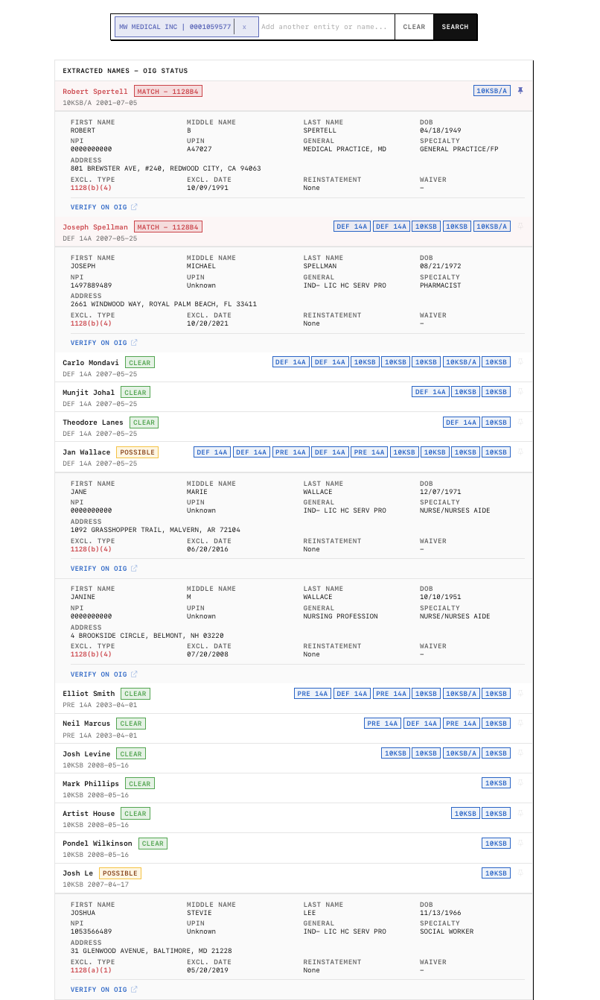

# CIK-OIG Check

SEC EDGAR entity search with OIG exclusion cross-reference. Search any SEC-registered entity by name or CIK number, extract affiliated persons from filings, and check them against the HHS OIG List of Excluded Individuals/Entities (LEIE).



## Features

- **Entity search** -- 1,021,688 SEC EDGAR entities indexed with fuzzy typeahead
- **Filing pipeline** -- Pulls and parses DEF 14A, 10-K, 10-Q, 8-K, S-1 filings for names
- **Name extraction** -- 10 regex patterns covering signatures, officer lists, narratives, departures, appointments
- **OIG cross-reference** -- Checks extracted names against the LEIE exclusion database (82,714 records)
- **OIG verification proxy** -- Server-side proxy handles ASP.NET ViewState/PostBack to return official OIG results
- **Person search** -- Direct name lookup against OIG without needing an entity
- **Pin names** -- Keep names across searches with the pin icon
- **Neo-brutalist UI** -- Monospace-first, terminal-inspired design with dark mode

## Quick Start

```bash
# Install dependencies
bun install

# Download/update data (CIK entities + OIG CSV)
bun run data:all

# Start dev server
bun run dev
```

Open [http://localhost:5173](http://localhost:5173).

## Data Sources

### SEC EDGAR Entities

Source: [SEC EDGAR Company Search](https://www.sec.gov/cgi-bin/browse-edgar?action=getcompany&company=&CIK=&type=&dateb=&owner=include&count=40&search_text=&action=getcompany)

The full SEC EDGAR company list (`cik-lookup-data.txt`) is parsed into 27 alpha-bucketed JSON files (`cik_a.json` through `cik_z.json`, plus `cik__.json` for numeric/special characters). Each entry contains a company name and 10-digit zero-padded CIK number.

| Stat | Value |
|------|-------|
| Total entities | 1,021,688 |
| Buckets | 27 |
| Total data size | 52 MB |
| Largest bucket | `cik_s.json` (4.7 MB) |
| Format | `[{"n":"NAME","c":"0000000001"},...]` |

Update CIK data:

```bash
# Requires edgar-cik-cli or cik-lookup-data.txt
bun run data:ciks
```

### OIG LEIE Database

Source: [HHS OIG Exclusions](https://oig.hhs.gov/exclusions/downloadables/UPDATED.csv)

The HHS Office of Inspector General publishes a monthly CSV snapshot of all excluded individuals and entities. The file is downloaded and parsed server-side into indexed maps keyed by normalized `lastname+firstname` and `businessname` for O(1) lookup.

| Stat | Value |
|------|-------|
| Records | 82,714 |
| File size | 15 MB |
| Update frequency | Monthly |
| Fields | 18 (name, DOB, NPI, UPIN, address, exclusion type/date, reinstatement, waiver) |

Update OIG data:

```bash
bun run data:oig
```

### SEC EDGAR Submissions API

Used at runtime to fetch filing metadata for a given CIK:

```
https://data.sec.gov/submissions/CIK{10-digit-CIK}.json
```

### SEC EDGAR Full-Text Search

Used for filing content retrieval:

```
https://efts.sec.gov/LATEST/search-index?q="{query}"&dateRange=custom&startdt=...&enddt=...&forms={form}
```

### OIG Verification Page

The OIG exclusion verification site uses ASP.NET WebForms with ViewState/EventValidation tokens:

```
https://exclusions.oig.hhs.gov/
```

The app includes a server-side proxy (`/api/oig/verify`) that fetches the page, extracts ASP.NET tokens, handles the cookie redirect chain, and POSTs the search form to return official verification results.

## Architecture

```
src/
  routes/
    +page.svelte          Main UI (search, results, explainer)
    +page.server.ts       Page data loader (entity count from manifest)
    api/
      submissions/[cik]/  SEC EDGAR submissions proxy
      filings/[cik]/[acc] Filing content fetcher + name extraction
      oig/search/         OIG LEIE batch name search
      oig/verify/         OIG verification page proxy (ASP.NET)
  lib/
    data/oig-parser.ts    OIG CSV parser + indexed search
    search/
      fuzzy-match.ts      Client-side fuzzy matching for typeahead
      name-extractor.ts   10-pattern regex name extraction from filings
    sec/rate-limiter.ts   SEC EDGAR rate limiter (10 req/sec)
    stores.ts             Svelte stores (log, extracted names, search state)
    types.ts              TypeScript interfaces
  app.css                 Global styles (neo-brutalist theme)
  app.html                HTML shell

static/
  data/                   Alpha-bucketed CIK JSON files (27 buckets)
  csvs/UPDATED.csv        OIG LEIE exclusion database
  fontawesome/            Font Awesome Pro 6.x (thin weight icons)

scripts/
  filter-healthcare-ciks.ts  Parse CIK data into bucketed JSON
  download-oig-csv.ts        Download latest OIG CSV
```

## Name Extraction Patterns

The name extractor (`src/lib/search/name-extractor.ts`) applies 10 regex patterns to each filing:

| # | Pattern | Regex | Example |
|---|---------|-------|---------|
| 1 | `/s/` signatures | `/\/s\/\s+([A-Z][a-z]+...)/g` | `/s/ John A. Smith` |
| 2 | `By:` signatures | `/By:\s*(?:\/s\/\s*)?([A-Z]...)/g` | `By: /s/ Jane Doe` |
| 3 | Name, Title | `/([A-Z]...)\s*,\s*(?:Chief\|President...)/g` | `Albert Bourla, CEO` |
| 4 | Title: Name | `/(?:CEO\|CFO...)[:\s]+([A-Z]...)/g` | `CEO: Albert Bourla` |
| 5 | SGML headers | `/FILED BY:\s*(.+?)(?:\n\|$)/gi` | `FILED BY: John Smith` |
| 6 | Director lists | `/([A-Z]...)\s+\d{2,3}\s+\d{4}/g` | `Jane Doe 58 2019` |
| 7 | Narrative | `/([A-Z]...)\s+(?:has\s+served\|...)/g` | `Jane Doe has served as...` |
| 8 | Departures | `/([A-Z]...)\s*,?\s*(?:resigned\|...)/g` | `Robert Spertell, resigned...` |
| 9 | Role descriptions | `/([A-Z]...)\s*,\s*(?:a\s+director\|...)/g` | `Jane Doe, a director...` |
| 10 | Appointments | `/([A-Z]...)\s+was\s+(?:appointed\|...)/g` | `John Smith was appointed as...` |

Names are validated against a blocklist of ~150 common words (titles, legal terms, financial jargon). Both first and last name components must be 2-30 characters and start with an uppercase letter.

## Filing Priority

Filings are processed in priority order (up to 20 per entity):

1. **DEF 14A / PRE 14A** -- Proxy statements (director/officer lists)
2. **10-K / 10-KSB** -- Annual reports (signatures, officer certifications)
3. **10-Q / 10-QSB** -- Quarterly reports (signature blocks)
4. **8-K** -- Current reports (appointments, departures)
5. **S-1** -- Registration statements (management bios)

## OIG Matching

- **Exact match** -- Normalized `lastname+firstname` key match
- **Partial match** -- Last name matches, first name is a prefix (e.g., "Rob" matches "Robert")
- **Business match** -- Substring match on business names

## Tech Stack

- [SvelteKit](https://kit.svelte.dev/) 2 with Svelte 5 (runes)
- [Bun](https://bun.sh/) runtime
- [Font Awesome](https://fontawesome.com/) Pro 6.x (thin weight)
- TypeScript
- Neo-brutalist CSS (no framework)

## Scripts

```bash
bun run dev          # Start development server
bun run build        # Build for production
bun run preview      # Preview production build
bun run data:ciks    # Regenerate CIK bucket files
bun run data:oig     # Download latest OIG exclusion CSV
bun run data:all     # Run both data scripts
```

## License

Private / proprietary.
